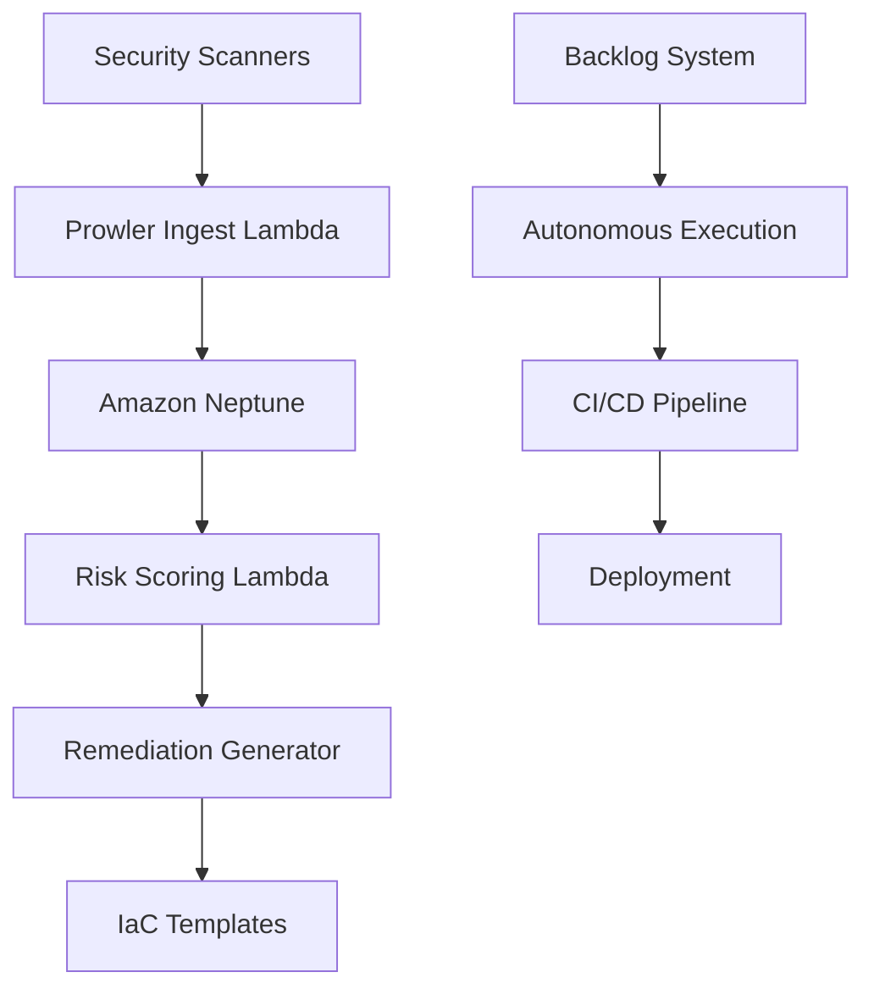
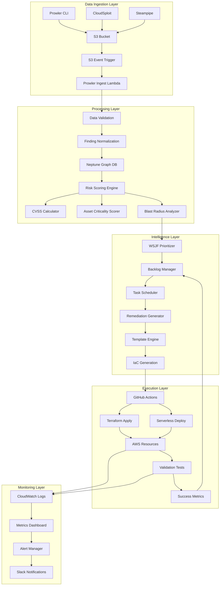
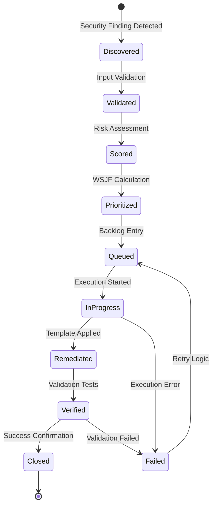
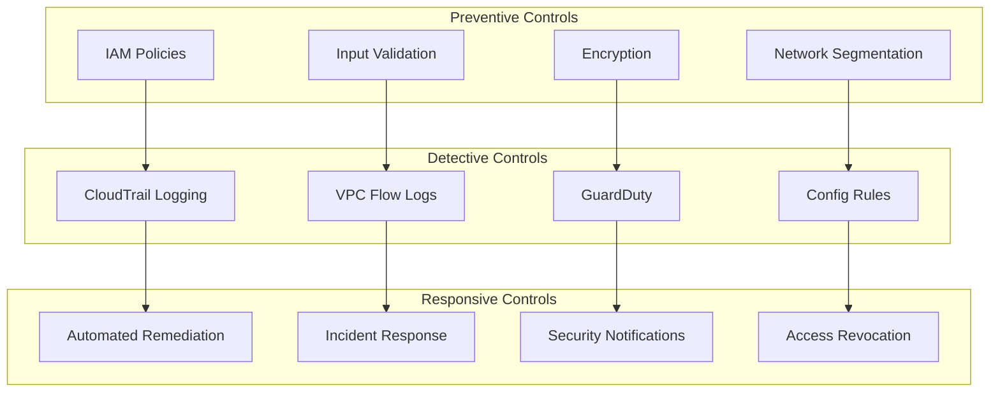

# Architecture Overview

## System Architecture

The Cloud Remediator Sage is a serverless, multi-cloud security posture management framework designed for autonomous operation. It follows a microservices architecture using AWS Lambda functions orchestrated through a centralized backlog management system.

## Core Components

### 1. Backlog Management System
- **Purpose**: Autonomous discovery, prioritization, and execution of security remediation tasks
- **Technology**: Node.js with WSJF (Weighted Shortest Job First) prioritization
- **Key Files**: `src/backlog/`

### 2. Security Analysis Engine
- **Purpose**: Risk assessment and vulnerability scoring
- **Components**:
  - Prowler ingestion (`src/lambda/prowler-ingest.js`)
  - Risk scoring (`src/lambda/risk-scoring.js`)
  - Remediation generation (`src/lambda/remediation-generator.js`)

### 3. Graph Database Integration
- **Technology**: Amazon Neptune with Gremlin queries
- **Purpose**: Risk correlation and blast radius analysis
- **Authentication**: IAM database authentication with SigV4

## Data Flow

### High-Level System Flow



### Detailed Data Flow Architecture



### State Transitions



## Deployment Architecture

### Serverless Components
- **Runtime**: Node.js 18.x
- **Orchestration**: Serverless Framework
- **Cloud Provider**: AWS (multi-cloud support planned)

### Security Layers
- **Authentication**: AWS IAM with least privilege
- **Network**: VPC with private subnets
- **Data**: Encryption at rest and in transit
- **Monitoring**: CloudWatch with structured logging

## Risk Scoring Formula

```
RiskScore = (CVSS_Weight * Asset_Exposure_Score) + Blast_Radius_Impact
```

### WSJF Prioritization
```
WSJF = (value + time_criticality + risk_reduction) ÷ effort
```

## Quality Attributes

### Security
- Zero-trust architecture
- Secrets management via AWS Parameter Store
- Input validation and sanitization
- SAST/SCA integration

### Scalability
- Serverless auto-scaling
- Event-driven processing
- Stateless design

### Reliability
- Circuit breaker patterns
- Retry mechanisms with exponential backoff
- Dead letter queues for failed processing

### Observability
- Structured logging with correlation IDs
- Distributed tracing
- Custom metrics and alarms

## Technology Stack

### Core Runtime
- **Language**: JavaScript (Node.js 18.x)
- **Package Manager**: npm
- **Testing**: Jest with coverage reporting
- **Linting**: ESLint with security rules

### AWS Services
- **Compute**: Lambda Functions
- **Database**: Amazon Neptune (Graph)
- **Storage**: S3 for artifacts
- **Orchestration**: Step Functions (planned)
- **Monitoring**: CloudWatch, X-Ray

### Development Tools
- **IaC**: Serverless Framework
- **CI/CD**: GitHub Actions
- **Security**: OWASP Dependency-Check, CodeQL
- **Documentation**: JSDoc, OpenAPI

## Decision Records

See `docs/adr/` directory for architectural decisions and their rationale.

## Integration Points

### External Security Tools
- **Prowler**: Multi-cloud security scanning
- **CloudSploit**: OCI security assessment
- **Steampipe**: Microsoft 365 compliance

### CI/CD Integration
- Autonomous backlog execution
- TDD cycle enforcement
- Security gate validation
- Automated conflict resolution

## Future Enhancements

### v0.2.0
- Azure and GCP remediation templates
- CloudSploit and Steampipe connectors
- Enhanced risk correlation algorithms

### v0.3.0
- Machine learning risk prediction
- Custom remediation workflows
- Multi-tenant support

## Security Architecture

### Zero-Trust Security Model

```mermaid
graph TD
    subgraph "Identity & Access Management"
        A1[IAM Roles] --> A2[Least Privilege]
        A2 --> A3[Resource-Based Policies]
        A3 --> A4[SCP Guardrails]
    end
    
    subgraph "Data Protection"
        B1[KMS Encryption] --> B2[S3 Server-Side Encryption]
        B1 --> B3[Neptune Encryption at Rest]
        B1 --> B4[Lambda Environment Variables]
        B2 --> B5[Bucket Policies]
        B3 --> B6[VPC Endpoints]
        B4 --> B7[Parameter Store]
    end
    
    subgraph "Network Security"
        C1[VPC Isolation] --> C2[Private Subnets]
        C2 --> C3[Security Groups]
        C3 --> C4[NACLs]
        C4 --> C5[VPC Flow Logs]
    end
    
    subgraph "Application Security"
        D1[Input Validation] --> D2[Output Encoding]
        D2 --> D3[SAST/SCA Scanning]
        D3 --> D4[Dependency Monitoring]
        D4 --> D5[Runtime Protection]
    end
```



### Threat Model & Mitigations

| Threat Category | Risk Level | Mitigation Strategy |
|----------------|------------|-------------------|
| **Supply Chain Attacks** | High | Dependency pinning, SHA verification, SBOM generation |
| **Credential Compromise** | High | Rotation policies, temporary credentials, MFA |
| **Code Injection** | Medium | Template sandboxing, input validation, CSP headers |
| **Privilege Escalation** | High | Least privilege IAM, resource boundaries, monitoring |
| **Data Exfiltration** | Medium | VPC endpoints, encryption, access logging |
| **Denial of Service** | Low | Rate limiting, auto-scaling, circuit breakers |

### Security Controls Matrix



## Performance Requirements

### SLA Targets
- **Ingestion Latency**: < 5 minutes for new findings
- **Risk Scoring**: < 30 seconds per finding
- **Remediation Generation**: < 2 minutes per template
- **Availability**: 99.9% uptime

### Scaling Limits
- **Concurrent Executions**: 1000 Lambda functions
- **Neptune Queries**: 100 concurrent connections
- **Storage**: Unlimited S3 with lifecycle policies

---

*This architecture supports the autonomous, security-first approach of the Cloud Remediator Sage while maintaining scalability and reliability for enterprise deployments.*