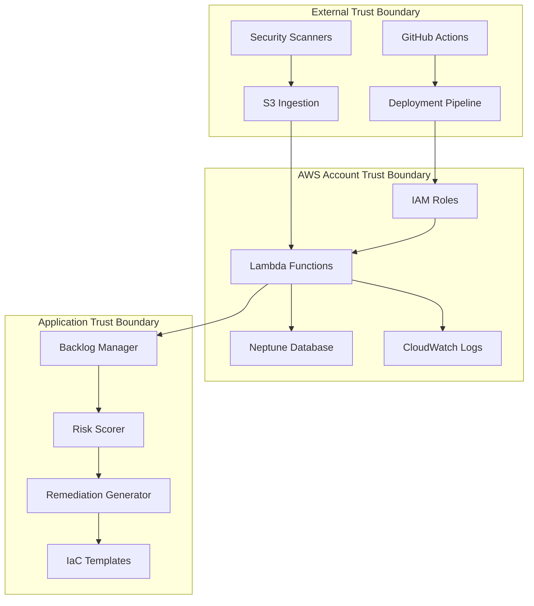
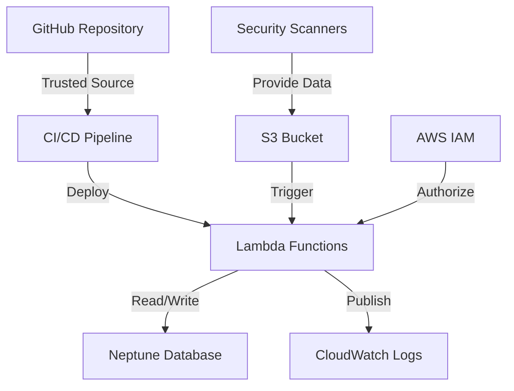

# Threat Model: Cloud Remediator Sage

## Executive Summary

The Cloud Remediator Sage is a security-critical system that automates cloud security posture management. This threat model identifies potential security risks, attack vectors, and mitigation strategies for the autonomous remediation platform.

## System Overview

### Trust Boundaries



### Data Flow Classification

| Data Type | Sensitivity | Trust Level | Encryption Required |
|-----------|-------------|-------------|-------------------|
| Security Findings | HIGH | External | Yes (in transit & rest) |
| Risk Scores | MEDIUM | Internal | Yes (at rest) |
| Remediation Templates | HIGH | Internal | Yes (in transit & rest) |
| Configuration Data | MEDIUM | Internal | Yes (at rest) |
| Audit Logs | HIGH | Internal | Yes (in transit & rest) |
| Metrics Data | LOW | Internal | Optional |

## Threat Analysis

### STRIDE Analysis

#### Spoofing Threats

**T001: Malicious Security Findings Injection**
- **Threat**: Attacker injects false security findings via compromised scanner
- **Impact**: HIGH - Could trigger inappropriate remediations
- **Likelihood**: MEDIUM
- **Mitigations**:
  - Digital signature verification of findings
  - Source authentication via IAM roles
  - Anomaly detection for unusual finding patterns
  - Manual approval gates for high-impact changes

**T002: IAM Role Assumption**
- **Threat**: Privilege escalation through compromised Lambda execution role
- **Impact**: CRITICAL - Full system compromise
- **Likelihood**: LOW
- **Mitigations**:
  - Least privilege IAM policies
  - Regular credential rotation
  - AWS CloudTrail monitoring
  - Cross-account role assumptions with external ID

#### Tampering Threats

**T003: Remediation Template Manipulation**
- **Threat**: Attacker modifies IaC templates to introduce backdoors
- **Impact**: CRITICAL - Infrastructure compromise
- **Likelihood**: MEDIUM
- **Mitigations**:
  - Template integrity checking with cryptographic hashes
  - Version control with signed commits
  - Template sandboxing and validation
  - Dry-run execution with manual review

**T004: Graph Database Corruption**
- **Threat**: Manipulation of risk relationships in Neptune
- **Impact**: HIGH - Incorrect risk prioritization
- **Likelihood**: LOW
- **Mitigations**:
  - Database encryption at rest
  - VPC isolation with private subnets
  - Query parameterization to prevent injection
  - Regular database backups and integrity checks

#### Repudiation Threats

**T005: Action Attribution Loss**
- **Threat**: Unable to trace automated actions to specific triggers
- **Impact**: MEDIUM - Compliance and audit issues
- **Likelihood**: MEDIUM
- **Mitigations**:
  - Comprehensive audit logging with correlation IDs
  - Digital signatures on all automated actions
  - Immutable log storage with tamper detection
  - Chain of custody documentation

#### Information Disclosure Threats

**T006: Sensitive Data Exposure in Logs**
- **Threat**: Security findings or credentials leaked in application logs
- **Impact**: HIGH - Exposure of vulnerability details
- **Likelihood**: MEDIUM
- **Mitigations**:
  - Log sanitization and filtering
  - Structured logging with sensitive data redaction
  - CloudWatch Logs encryption
  - Access controls on log streams

**T007: Side-Channel Information Leakage**
- **Threat**: Timing attacks reveal information about internal processes
- **Impact**: LOW - Limited information disclosure
- **Likelihood**: LOW
- **Mitigations**:
  - Constant-time operations for sensitive comparisons
  - Random delays in processing
  - Metrics aggregation to prevent inference

#### Denial of Service Threats

**T008: Resource Exhaustion Attack**
- **Threat**: Overwhelming system with malicious findings or requests
- **Impact**: MEDIUM - Service disruption
- **Likelihood**: MEDIUM
- **Mitigations**:
  - Lambda concurrency limits
  - API Gateway throttling
  - DLQ for failed processing
  - Auto-scaling with circuit breakers

**T009: Graph Database Query Bomb**
- **Threat**: Complex queries designed to consume excessive resources
- **Impact**: HIGH - Database unavailability
- **Likelihood**: LOW
- **Mitigations**:
  - Query complexity analysis
  - Timeout limits on database operations
  - Resource monitoring and alerting
  - Query result size limits

#### Elevation of Privilege Threats

**T010: Container Escape**
- **Threat**: Breaking out of Lambda execution environment
- **Impact**: HIGH - AWS account compromise
- **Likelihood**: VERY LOW
- **Mitigations**:
  - AWS-managed runtime security
  - Minimal container images
  - Runtime security monitoring
  - Regular patching of dependencies

**T011: Cross-Function Privilege Escalation**
- **Threat**: One Lambda function gaining access to another's resources
- **Impact**: MEDIUM - Lateral movement
- **Likelihood**: LOW
- **Mitigations**:
  - Function-specific IAM roles
  - Resource-based policies
  - VPC network segmentation
  - Least privilege principle

## Risk Assessment Matrix

| Threat ID | Impact | Likelihood | Risk Level | Priority |
|-----------|--------|------------|------------|----------|
| T001 | HIGH | MEDIUM | HIGH | P1 |
| T002 | CRITICAL | LOW | HIGH | P1 |
| T003 | CRITICAL | MEDIUM | CRITICAL | P0 |
| T004 | HIGH | LOW | MEDIUM | P2 |
| T005 | MEDIUM | MEDIUM | MEDIUM | P2 |
| T006 | HIGH | MEDIUM | HIGH | P1 |
| T007 | LOW | LOW | LOW | P3 |
| T008 | MEDIUM | MEDIUM | MEDIUM | P2 |
| T009 | HIGH | LOW | MEDIUM | P2 |
| T010 | HIGH | VERY LOW | LOW | P3 |
| T011 | MEDIUM | LOW | LOW | P3 |

## Security Controls Mapping

### Preventive Controls

| Control ID | Description | Threats Mitigated | Implementation |
|------------|-------------|-------------------|----------------|
| PC-001 | Input validation | T001, T004 | JSON schema validation, sanitization |
| PC-002 | IAM least privilege | T002, T011 | Resource-specific policies |
| PC-003 | Template validation | T003 | Static analysis, checksums |
| PC-004 | Network segmentation | T002, T004, T011 | VPC with private subnets |
| PC-005 | Encryption in transit | T006 | TLS 1.3, VPC endpoints |
| PC-006 | Encryption at rest | T004, T006 | KMS encryption |

### Detective Controls

| Control ID | Description | Threats Mitigated | Implementation |
|------------|-------------|-------------------|----------------|
| DC-001 | Audit logging | T005 | CloudTrail, structured logs |
| DC-002 | Anomaly detection | T001, T008 | CloudWatch metrics, alarms |
| DC-003 | Integrity monitoring | T003, T004 | File/database checksums |
| DC-004 | Performance monitoring | T008, T009 | Lambda metrics, timeouts |
| DC-005 | Security scanning | T003, T006 | SAST, dependency scanning |

### Responsive Controls

| Control ID | Description | Threats Mitigated | Implementation |
|------------|-------------|-------------------|----------------|
| RC-001 | Incident response | ALL | Automated alerting, runbooks |
| RC-002 | Access revocation | T002, T011 | IAM policy updates |
| RC-003 | Service isolation | T008, T009 | Circuit breakers, rate limiting |
| RC-004 | Backup restoration | T003, T004 | Automated recovery procedures |

## Assumptions and Dependencies

### Security Assumptions

1. **AWS Security Model**: AWS provides secure infrastructure and services
2. **IAM Effectiveness**: IAM policies are correctly implemented and enforced
3. **Network Security**: VPC provides adequate network isolation
4. **Encryption**: AWS KMS provides sufficient encryption capabilities
5. **Lambda Runtime**: AWS Lambda execution environment is secure

### External Dependencies

1. **Security Scanners**: Prowler, CloudSploit provide accurate findings
2. **GitHub**: Source code repository security and availability
3. **Third-party Libraries**: NPM packages are secure and maintained
4. **AWS Services**: Neptune, S3, CloudWatch availability and security

### Trust Relationships



## Recommendations

### Immediate Actions (P0)

1. **Implement template integrity checking** for T003
2. **Add digital signature verification** for security findings
3. **Enhanced input validation** with comprehensive schema checking
4. **Implement circuit breakers** for external dependencies

### Short-term Actions (P1)

1. **Deploy anomaly detection** for unusual finding patterns
2. **Implement comprehensive audit logging** with correlation IDs
3. **Add query complexity analysis** for Neptune operations
4. **Enhanced log sanitization** to prevent information disclosure

### Medium-term Actions (P2)

1. **Implement automated threat modeling** updates
2. **Deploy runtime security monitoring** for containers
3. **Add performance baseline monitoring** for DoS detection
4. **Implement automated incident response** procedures

### Long-term Actions (P3)

1. **Regular penetration testing** and security assessments
2. **Implement zero-trust architecture** principles
3. **Add machine learning-based** anomaly detection
4. **Develop automated threat intelligence** integration

## Monitoring and Alerting

### Security Metrics

```yaml
metrics:
  authentication_failures:
    threshold: 5
    window: 5m
    severity: high
  
  unusual_finding_volume:
    threshold: 1000
    window: 15m
    severity: medium
  
  remediation_failures:
    threshold: 10%
    window: 1h
    severity: high
  
  database_query_time:
    threshold: 30s
    window: 1m
    severity: medium
```

### Alert Escalation

1. **P0 Alerts**: Immediate notification to security team
2. **P1 Alerts**: Notification within 15 minutes
3. **P2 Alerts**: Notification within 1 hour
4. **P3 Alerts**: Daily summary report

## Review Schedule

- **Monthly**: Threat landscape updates, new vulnerability assessment
- **Quarterly**: Full threat model review, control effectiveness assessment
- **Annually**: Comprehensive security architecture review, penetration testing

---

*This threat model is a living document and should be updated as the system evolves and new threats emerge.*